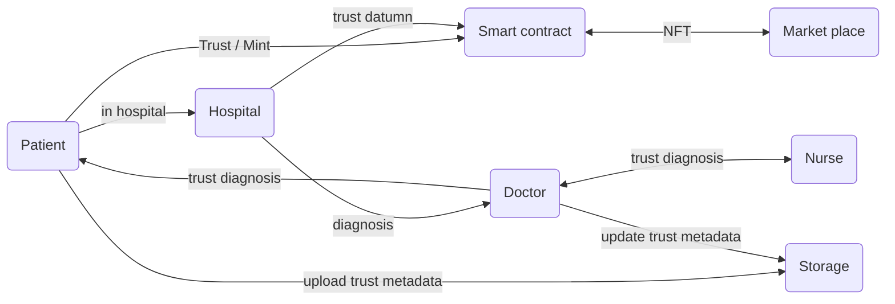
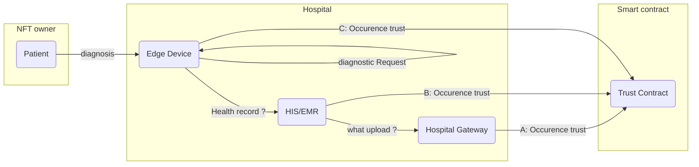
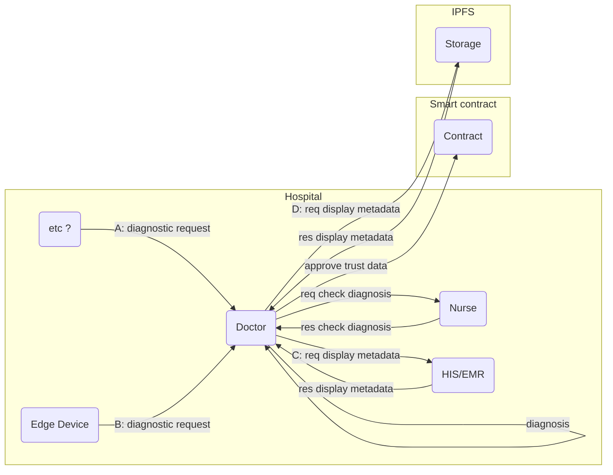
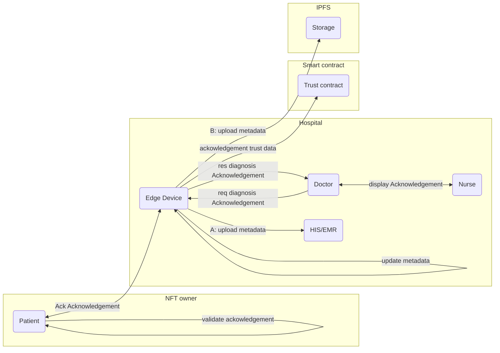

## Trust Architecture

-----

### Diagram

#### Actor

#### In Hospital (Usecase)

##### Trust Occurrence

- Pattern

1. A: Upsert trust datumn to smart contract from Hospital Gateway
2. B: Upsert trust datumn to smart contract from HIS/EMR
   1. the term
      1. HIS(Hospital Information System)
      2. EMR(Electronic Medical Record)
3. C: Upsert trust datumn to smart contract from edge device

##### Trust Approve

- Diagnostic request pattern

1. A: Diagnostic request to hospital Doctor from etc ?
2. B: Diagnostic request to hospital Doctor from Edge device

- show metadata (diagnosis) pattern

1. C: display metadata from HIS/EMR
2. D: display metadata from Storage

#### Trust Acknowledgement

- upload metadata(Health record) Pattern

1. A: upload metadata to HIS/EMR
2. B: upload metadata to Storage(IPFS)

