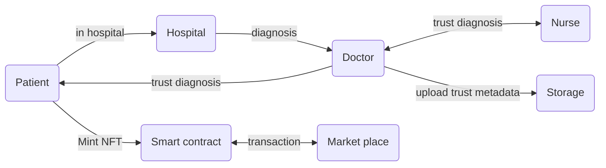
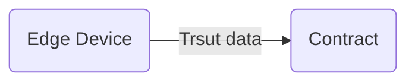
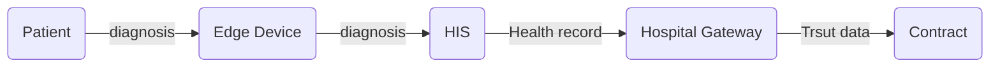
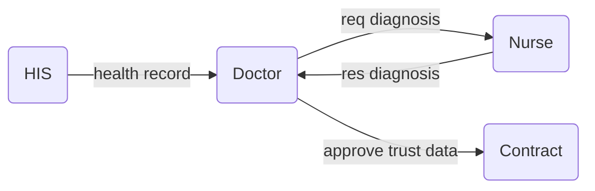
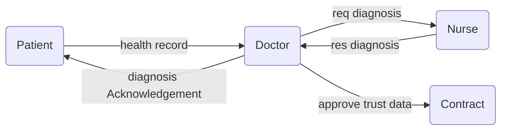

## Trust Architecture

-----

### Diagram

#### Actor

```mermaid
  flowchart LR
    id1(Patient) -- in hospital --> id2(Hospital)
    id2(Hospital) -- diagnosis --> id3(Doctor) -- trust diagnosis --> id1
    id3(Doctor) <-- trust diagnosis --> id4(Nurse)
    id1(Patient) -- Mint NFT --> id5(Smart contract)
    id3(Doctor) -- upload trust metadata --> id6(Storage)
    id5(Smart contract) <-- transaction --> id7(Market place)
```

#### In Hospital (Usecase)

- Occurrence

```mermaid
  flowchart LR
  id1(Edge Device) -- Trsut data --> id2(Contract)
```

```mermaid
  flowchart LR
  id1(Patient) -- diagnosis --> id2(Edge Device)
  id2(Edge Device) -- diagnosis --> id3(HIS)
  id3(HIS) -- Health record --> id4(Hospital Gateway)
  id4(Hospital Gateway) -- Trsut data --> id5(Contract)
```

- Approve

```mermaid
  flowchart LR
  id1(HIS) -- health record --> id2(Doctor)
  id2(Doctor) -- req diagnosis --> id3(Nurse)
  id3(Nurse) -- res diagnosis --> id2(Doctor)
  id2(Doctor) -- approve trust data --> id4(Contract)
```

- Acknowledgement

```mermaid
  flowchart LR
  id1(Patient) -- health record --> id2(Doctor)
  id2(Doctor) -- diagnosis Acknowledgement--> id1(Patient)
  id2(Doctor) -- req diagnosis --> id3(Nurse)
  id3(Nurse) -- res diagnosis --> id2(Doctor)
  id2(Doctor) -- approve trust data --> id4(Contract)
```
