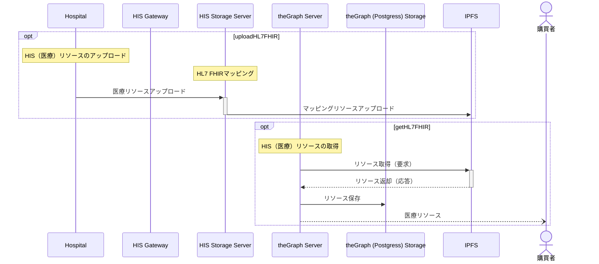

# Usecase for PHR smart contract

-----

```mermaid 
    sequenceDiagram 
    
    participant Hp as Hospital
    participant Hg as HIS Gateway
    participant Hs as HIS Storage Server
    participant Gsv as theGraph Server
    participant Gst as theGraph (Postgress) Storage
    participant IPFS
    actor U as 購買者

    opt uploadHL7FHIR
        Note over  Hp: HIS（医療）リソースのアップロード
        Note over  Hs: HL7 FHIRマッピング
        Hp ->>+ Hs: 医療リソースアップロード
        Hs ->>- IPFS: マッピングリソースアップロード
    end

    opt getHL7FHIR
        Note over   Gsv: HIS（医療）リソースの取得
        Gsv ->>+ IPFS: リソース取得（要求）
        IPFS -->>- Gsv: リソース返却（応答）
        Gsv ->> Gst: リソース保存
        Gsv --) U: 医療リソース
    end
```
